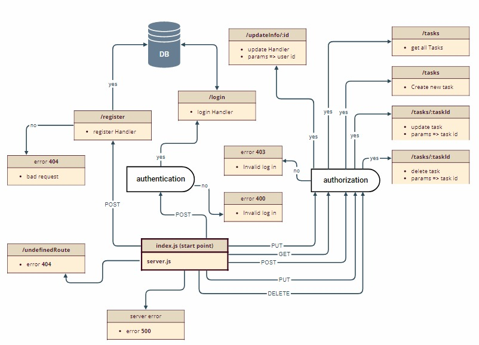

# todo API

## root route [root](https://todoapi-khamees.herokuapp.com)

## registration endpoints

- endpoint: `/register`
- REQ: `post` [register](https://todoapi-khamees.herokuapp.com/register)
- Data: firstName, lastName, email, password

## login endpoints

- endpoint: `/login`
- REQ: `post` [login](https://todoapi-khamees.herokuapp.com/login)
- Data: email, password

## update user info endpoints

- endpoint: `/updateInfo/:userId`
- REQ: `put` [updateProfile](https://todoapi-khamees.herokuapp.com/updateInfo/:userId)
- `params` => user id
- Data: firstName, lastName, email, password

## Get user tasks endpoints

- endpoint: `/tasks`
- REQ: `get` [getAllTasks](https://todoapi-khamees.herokuapp.com/tasks)

## create new task for the user endpoints

- endpoint: `/tasks`
- REQ: `post` [creatTask](https://todoapi-khamees.herokuapp.com/tasks)
- Data: title, description, priority, isCompleted

## Update user task endpoints

- endpoint: `/tasks/:taskId`
- REQ: `put` [updateTask](https://todoapi-khamees.herokuapp.com/tasks/:taskId)
- `params` => task id
- Data: title, description, priority, isCompleted

## Delete user task endpoints

- endpoint: `/tasks/:taskId`
- REQ: `delete` [deleteTask](https://todoapi-khamees.herokuapp.com/tasks/:taskId)
- `params` => task id

### UML Diagram

